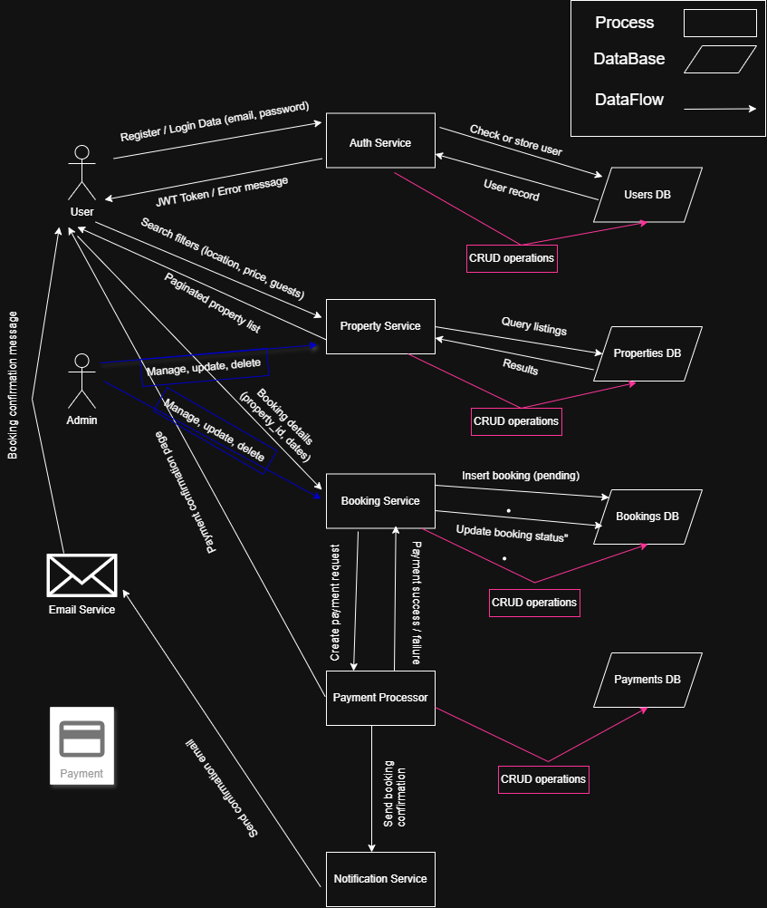

# 📊 Data Flow Diagram (DFD)

This diagram illustrates how data flows in the Airbnb Clone backend.

It shows the main processes (Authentication, Property, Booking, Payment, and Notification),
as well as the interactions between the User, Admin, and external services.

