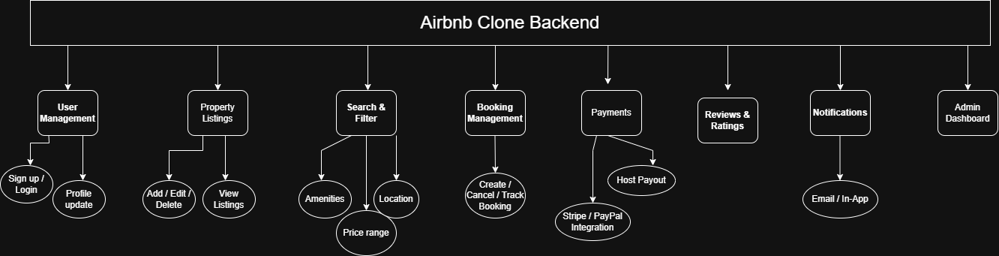

# Airbnb Clone - Backend Features and Functionalities

This document outlines the core backend features for the Airbnb Clone project.

## 🔑 Core Functionalities
1. User Management (Sign up / Login)
2. Property Listings (Add, View, Edit, Delete)
3. Booking System (Create, Cancel, View Bookings)
4. Payment Integration (Secure Payments, Multi-currency)

## 🧭 Features Diagram
The diagram below illustrates the relationship between the main backend functionalities:

