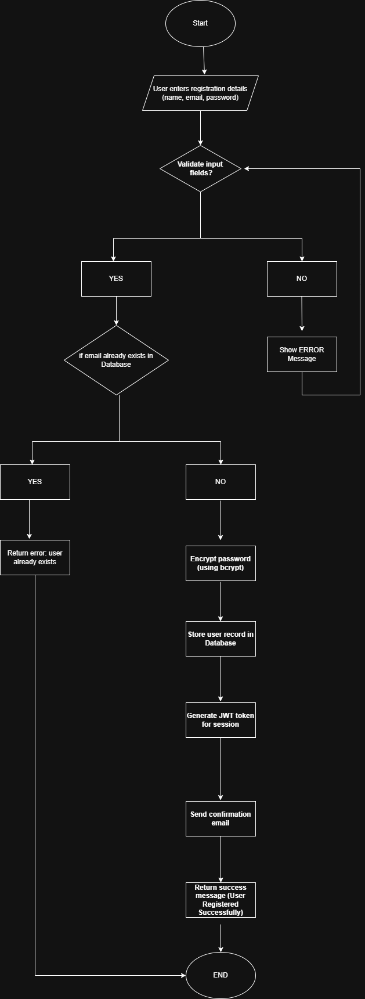

# 🧭 Flowchart - User Registration Process

This flowchart illustrates the steps involved in the **User Registration** process
in the Airbnb Clone backend.

It shows how user data is validated, checked for duplicates,
stored securely in the database, and followed by sending a confirmation email.

