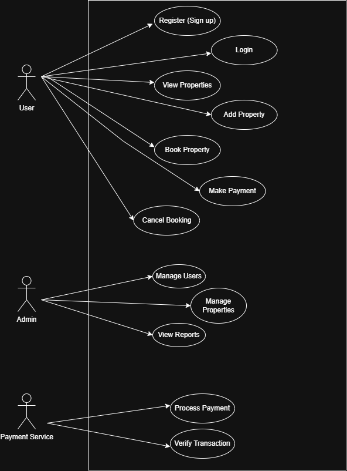

# Use Case Diagram - Airbnb Clone

This diagram shows the main actors and use cases in the Airbnb Clone backend system.

## 🎭 Actors
- User
- Admin
- Payment Service

## ⚙️ Use Cases
- Register / Login
- View & Manage Properties
- Book & Cancel Property
- Make Payments
- Manage Users (Admin)
- Process Transactions (Payment Service)

